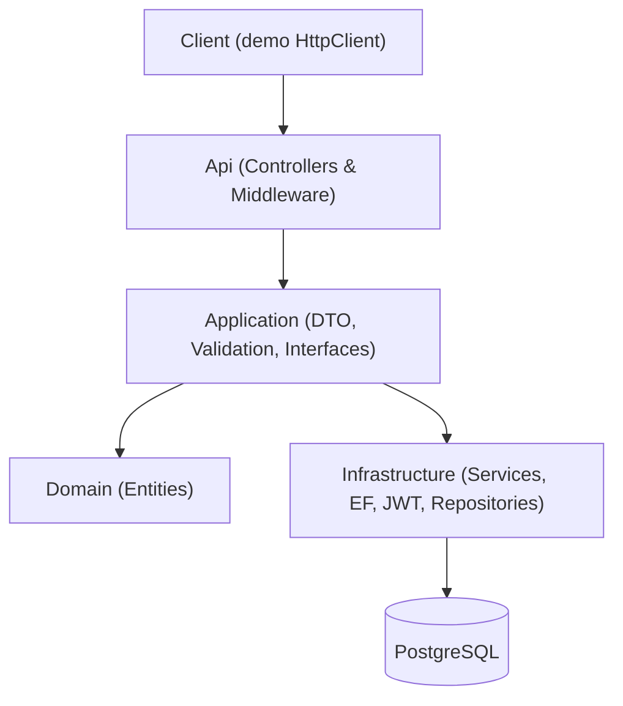
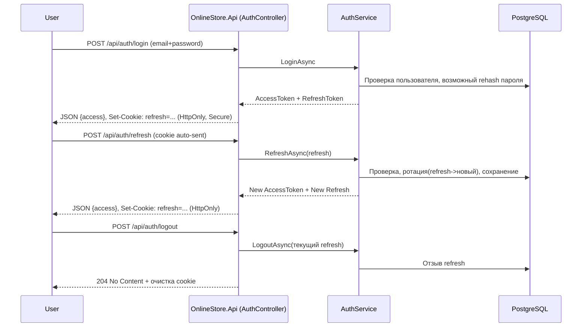

# OnlineStore

Pet‑проект интернет‑магазина на **ASP.NET Core (.NET)** и **PostgreSQL**.
Слои по духу Clean Architecture: **Api → Application → Domain → Infrastructure**.
Акцент на **безопасность**, **прозрачную архитектуру** и **наглядность для портфолио**.

---

## Архитектура (слои)



* **Api** — контроллеры, middleware, Swagger, валидация.
* **Application** — DTO, интерфейсы сервисов/репозиториев, валидаторы, исключения, маппинг.
* **Domain** — чистые сущности (без зависимостей от инфраструктуры).
* **Infrastructure** — EF Core (DbContext, конфигурации), репозитории, сервисы, JWT, cookies, DI.

---

## Поток аутентификации (Login / Refresh / Logout)



**Почему так**

* **Access (JWT)** короткоживущий (обычно 15–30 мин) → возвращается в теле ответа, хранится на клиенте.
* **Refresh** долгоживущий (дни) → только **HttpOnly cookie** (недоступен JS), обновляется *ротацией*.
* Управление сессиями: список активных, закрытие одной, `logout-all` (отозвать все refresh).

---

## Структура каталогов

```text
OnlineStore/
├── OnlineStore.Api/                 # Web API (controllers, middleware, Program.cs)
│   ├── Controllers/                 # AuthController, AdminUsersController
│   ├── Extensions/                  # Swagger, Validation, RateLimiting
│   ├── Middlewares/                 # ExceptionHandlingMiddleware (ProblemDetails)
│   └── Program.cs
├── OnlineStore.Application/         # DTO, интерфейсы, валидация, маппинг, исключения
│   ├── DTOs/Auth/                   # RegisterRequest, LoginRequest, ChangePasswordRequest, AuthResponse, UserProfileDto, SessionDto
│   ├── Exceptions/                  # UnauthorizedAppException, ForbiddenAppException, NotFoundException, ConflictAppException
│   ├── Interfaces/Repositories/     # IUserRepository, IRefreshTokenRepository
│   ├── Interfaces/Services/         # IAuthService, IUsersService
│   ├── Mappings/                    # AutoMapper профили (напр., User -> UserProfileDto)
│   ├── Validation/Auth/             # Register/Login/ChangePassword валидаторы
│   └── Validation/Extensions/       # PasswordPolicy, PasswordRuleExtensions, EmailRuleExtensions
├── OnlineStore.Domain/              # Сущности (без зависимостей)
│   └── Entities/                    # User, RefreshToken, Project, Model3D, Cart, Order ...
├── OnlineStore.Infrastructure/      # Реализация (EF, сервисы, DI, JWT, cookies)
│   ├── Options/                     # JwtOptions
│   ├── Persistence/                 # AppDbContext, Configurations/*
│   ├── Repositories/                # UserRepository, RefreshTokenRepository
│   ├── Security/                    # JwtAuth, CookieFactory, CookieNames, SafeLog
│   └── Services/                    # AuthService, UsersService
├── OnlineStore.Client/              # Demo console client (HttpClient + CookieContainer)
│   ├── BearerAuthHandler.cs         # авто-refresh access при 401
│   └── Program.cs
└── README.md
```

---

## Стиль работы с БД (важно)

* **Репозитории** НЕ вызывают `SaveChangesAsync()` — они только модифицируют контекст.
* **Сервисы** собирают изменения и делают **один** `_db.SaveChangesAsync()` (при необходимости в транзакции).
* Плюсы: атомарность и понятные границы транзакций в бизнес‑логике.

---

## Исключения и ошибки (единый формат)

* Кидаем кастомные `AppException`: `Unauthorized` (401), `Forbidden` (403), `NotFound` (404), `Conflict` (409).
* Любая непредвиденная ошибка → 500.
* Ответы об ошибках — **RFC7807 ProblemDetails** (`application/problem+json`) через `ExceptionHandlingMiddleware`.
* Логи с PII (email/токены) маскируются в `SafeLog`.

---

## Валидация

* **FluentValidation** во всём API.
* **Login** — минимальная валидация (email валиден, пароль не пустой), без подсказок по сложности.
* **Registration / Change password** — строгие правила: длина ≥ 8, заглавная/строчная/цифра/спецсимвол, без пробелов в начале/конце, пароль не содержит email.
* Общие правила — `PasswordRuleExtensions.StrongPassword()` (DRY).

---

## Эндпоинты (Auth)

* `POST /api/auth/register` — регистрация; access в body, refresh в HttpOnly‑cookie.
* `POST /api/auth/login` — вход; access в body, refresh в HttpOnly‑cookie.
* `POST /api/auth/refresh` — без тела; читает refresh из cookie, отдаёт новый access и ротацию cookie.
* `POST /api/auth/logout` — выход из текущей сессии; отзывает refresh и очищает cookie.
* `POST /api/auth/logout-all` — отозвать все refresh пользователя (все сессии).
* `GET  /api/auth/sessions` — список активных сессий.
* `DELETE /api/auth/sessions/{id}` — закрыть конкретную сессию по Id refresh‑токена.
* `POST /api/auth/admin/logout-all/{userId}` — \[Admin] закрыть все сессии пользователя.
* *(опционально)* `GET /api/auth/me` — профиль текущего пользователя по access‑токену.

Статусы:

* Успех: 200/204.
* Ошибки: 400 (валидация), 401 (неавторизован/невалидный токен), 403 (нет прав), 404, 409 (конфликт), 429 (rate limiting), 500.

---

## CORS и Cookies

* CORS разрешает **credentials** (cookies). Настрой разрешённые origin‑ы под фронтенд.
* Refresh‑cookie: `HttpOnly`, `Secure` (в проде), `SameSite=Lax` (или `None` для кросс‑домена + HTTPS), корректный `Path` и `Expires` задаёт `CookieFactory`.

---

## Настройка окружения (локально)

### 1) PostgreSQL

Через Docker:

```bash
docker run --name store-db -e POSTGRES_PASSWORD=pass -p 5432:5432 -d postgres:15
```

`appsettings.Development.json` (пример):

```json
{
  "ConnectionStrings": {
    "Default": "Host=localhost;Port=5432;Database=store;Username=postgres;Password=pass"
  }
}
```

### 2) Secret Manager (JWT‑ключ ≥ 32 байта)

```bash
dotnet user-secrets init --project OnlineStore.Api/OnlineStore.Api.csproj

# Сгенерируй 32‑байтный base64 (PowerShell):
# [Convert]::ToBase64String([System.Security.Cryptography.RandomNumberGenerator]::GetBytes(32))

dotnet user-secrets set "Jwt:Key" "<BASE64_32BYTES>" --project OnlineStore.Api
dotnet user-secrets set "Jwt:Issuer" "OnlineStore"    --project OnlineStore.Api
dotnet user-secrets set "Jwt:Audience" "OnlineStore"  --project OnlineStore.Api
dotnet user-secrets list --project OnlineStore.Api
```

Если при запуске видишь ошибку `Jwt:Key must be at least 32 bytes` — ключ слишком короткий или не подхватился.

### 3) Миграции EF Core

```bash
# добавить миграцию
dotnet ef migrations add Init -p OnlineStore.Infrastructure -s OnlineStore.Api
# применить в БД
dotnet ef database update -p OnlineStore.Infrastructure -s OnlineStore.Api
```

---

## Запуск

```bash
dotnet ef database update -p OnlineStore.Infrastructure -s OnlineStore.Api
dotnet run --project OnlineStore.Api
```

* API: [http://localhost:5232/swagger](http://localhost:5232/swagger)
* Demo Client: `dotnet run --project OnlineStore.Client`

---

## Советы по разработке

* **VS Code**: C# Dev Kit / Roslyn, EF Core Power Tools, Markdown All in One.
* **Swagger**: включена схема Bearer — удобно тестировать login/refresh.
* **Rate limiting**: `ip-login` (например, 10/мин), `ip-register` (например, 3/мин). Единый ответ 429 в ProblemDetails.
* **Логи**: `SafeLog` для маскировки email/токенов.

---

## Roadmap

* [ ] Email‑подтверждение и «забыли пароль» (через Outbox‑паттерн).
* [ ] Docker‑compose: API + DB + Frontend.
* [ ] CI/CD (GitHub Actions): build + test + deploy.
* [ ] Расширение модулей Orders/Cart.
* [ ] Unit/Integration тесты (xUnit + Testcontainers).
* [ ] Мониторинг: Serilog + Seq / OpenTelemetry.

---